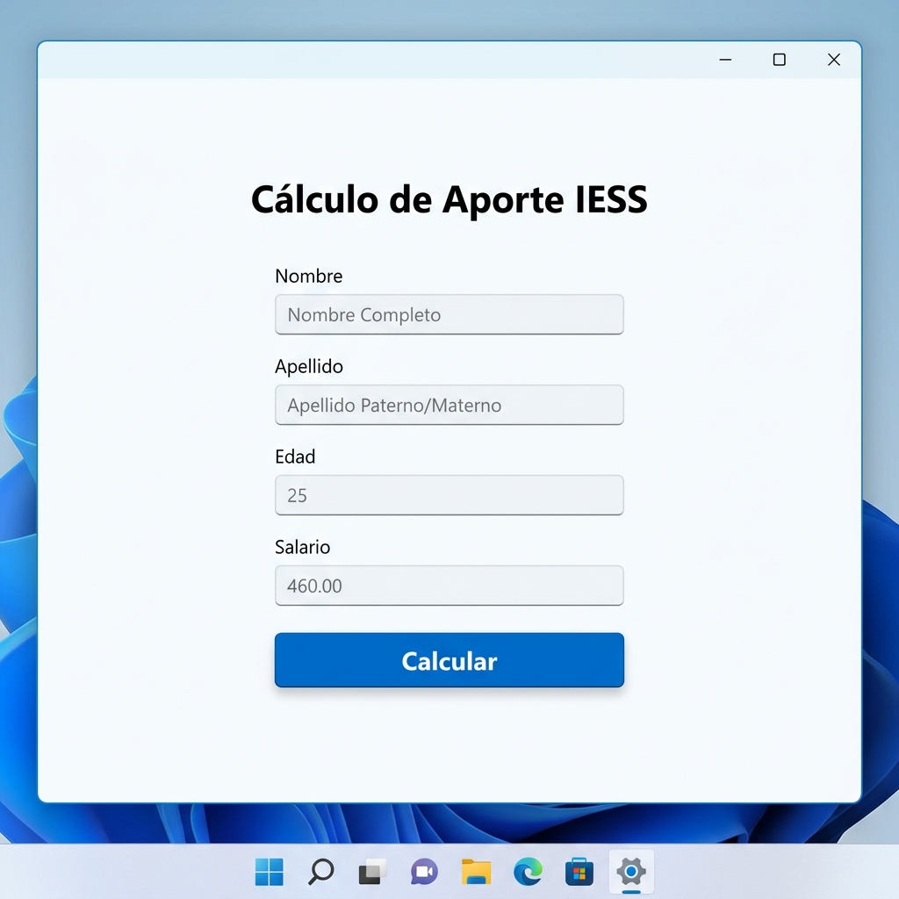
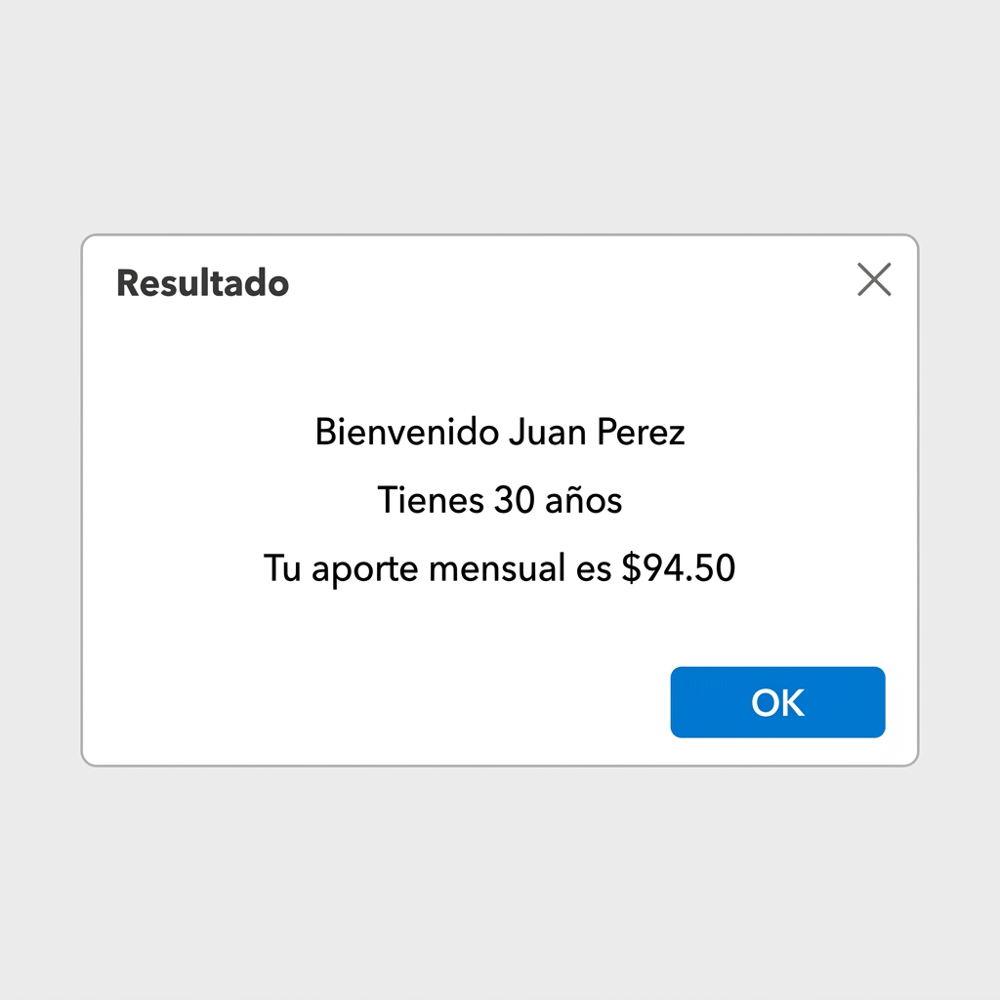

# Explicación del funcionamiento - Actividad 1: Desarrollo de Aplicación MAUI

## 1. Diseño de la Interfaz (XAML)
El diseño de la aplicación se desarrolló en el archivo `MainPage.xaml`. Se utilizó un `ScrollView` como contenedor principal para asegurar que la interfaz sea navegable en pantallas pequeñas. Dentro de este, se estructuró la vista con un `VerticalStackLayout`, que incluye:
- Un **Label** como título principal ("Cálculo de Aporte IESS").
- Cuatro **Entry** para recolectar los datos: "Nombre", "Apellido", "Edad" y "Salario".
- En los campos de "Edad" y "Salario", se configuró la propiedad `Keyboard="Numeric"` para asegurar que el teclado mostrado en el dispositivo sea exclusivamente numérico, lo que ayuda a evitar errores de entrada.
- Un **Button** ("Calcular") vinculado al evento `Clicked="OnCalcularClicked"`.

## 2. Lógica y Funcionalidad (C#)
En el archivo de código subyacente `MainPage.xaml.cs`, se implementó la lógica en el método `OnCalcularClicked`:
- **Validaciones:** Se verifica primero que ninguna de las cajas de texto esté vacía usando `string.IsNullOrWhiteSpace()`. Si alguno falta, se despliega una alerta. 
- **Conversión de datos:** Se valida y convierten los valores de "Edad" (a `int`) y "Salario" (a `double`) usando `TryParse`. Si estos contienen caracteres no válidos o fallan, se muestra su respectiva alerta de error, cumpliendo el requerimiento de solo aceptar números.
- **Cálculo:** Se calcula el valor del aporte multiplicando el salario por `0.0945` (que representa el 9.45%).
- **Salida:** Se compone un mensaje en formato string interpolation (`$"..."`) con saltos de línea (`\n`) mostrando el Nombre, Apellido, Edad y el monto calculado. Al final se despliega este resultado en una alerta utilizando el método `DisplayAlert` de .NET MAUI.

## 3. Capturas de la Aplicación

Vista de la interfaz principal:

Vista de la alerta de resultados al presionar Calcular:

## 4. Enlace del Repositorio en GitHub

El código fuente de esta aplicación se encuentra disponible en GitHub:
[https://github.com/kevin/IessApp-Maui](https://github.com/kevin/IessApp-Maui) *(Nota: reemplaza esto por tu enlace real)*
